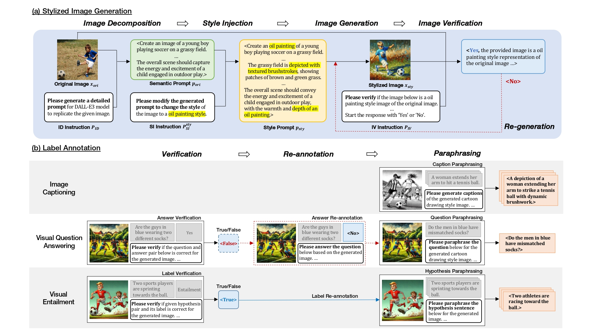

# VolDoGer: LLM-assisted Datasets for Domain Generalization in Vision-Language Tasks

## Introduction

This repository contains the source code for the paper ["VolDoGer: LLM-assisted Datasets for Domain Generalization in Vision-Language Tasks"](https://arxiv.org/pdf/2407.19795). We propose data annotation scheme for vision-language tasks using large language models (LLMs). Especially, we focus on the stylistic domain generalization in vision-language tasks. We demonstrate that our method can effectively generate the stylistic domain generalization dataset. Please refer to the paper for more details.



## Experiment

```shell
$ conda create -n proj-voldoger python=3.8
$ conda activate proj-voldoger
$ pip install torch==1.13.1+cu116 torchvision==0.14.1+cu116 torchaudio==0.13.1 --extra-index-url https://download.pytorch.org/whl/cu116
$ pip install -r requirements.txt
```

## Citation

```bibtex
@article{choi2024voldoger,
  title={VolDoGer: LLM-assisted Datasets for Domain Generalization in Vision-Language Tasks},
  author={Choi, Juhwan and Kwon, Junehyoung and Yun, JungMin and Yu, Seunguk and Kim, YoungBin},
  journal={arXiv preprint arXiv:2407.19795},
  year={2024}
}
```
